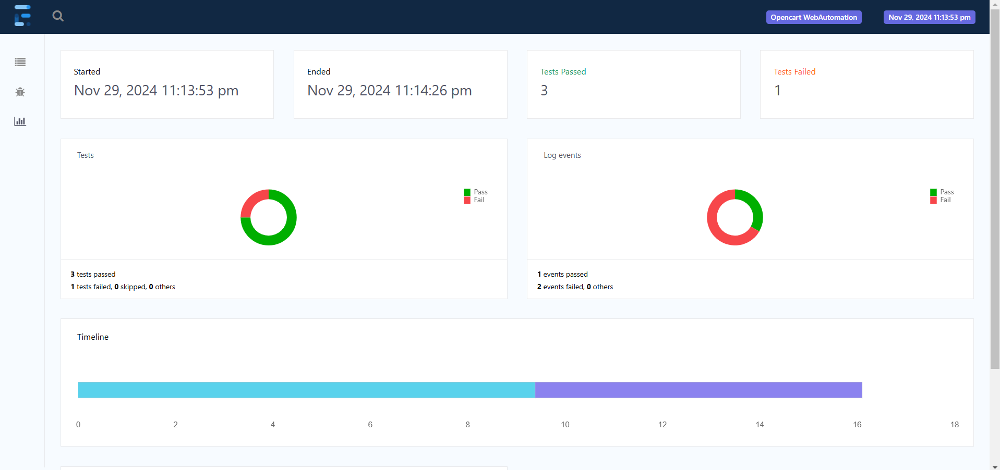
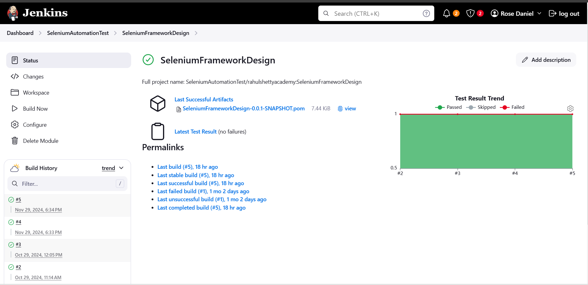

# 🛒 OpenCart Automation Testing Project

## 📄 Description
This is an 🛠️ automation testing project for an OpenCart 🛍️ electronic store. Built using Selenium 🕸️ with Java ☕ and TestNG 🧪, the project automates major test scenarios such as validating website login 🔑, placing orders 🛒, utilizing the search box 🔍, and more. The project ensures robust testing of the store's core functionalities ✅.

---

## 🌟 Features
- **Dynamic Design:** Uses the Page Object Model (POM) 📄 design pattern, ensuring minimal maintenance 🛠️ and high scalability 📈.
- **Advanced Concepts:**
  - Implements Page Factory 🏭 for efficient object handling 🖼️.
  - Utilizes advanced Java ☕ concepts like Streams 🚿 for data processing.
  - Employs Listeners 👂 to monitor test execution.
  - Generates comprehensive reports 📊 using Extent Reports 📝.
  - Manages flaky test cases 🎭 with IRetryAnalyzer.
- **Data-Driven Testing:** Dynamic test data 📂 is sourced through JSON files 🗂️.
- **Build and CI/CD Integration:**
  - Managed with Maven 🏗️ for build automation.
  - Integrated with Jenkins 🖥️ to establish a high-level CI/CD pipeline 🔄, automatically triggering test cases on code push 🚀.
- **Comprehensive Selenium Concepts:** Covers testing of:
  - 📋 Tables
  - 📜 Scrolling
  - 🔽 Dropdowns
  - 🔴 Pop-ups
  - 🖼️ IFrames and more
 
---

## 🧰 Key Technologies
- **Automation Framework:** Selenium 🕸️ with Java ☕
- **Test Management:** TestNG 🧪
- **Build Management:** Maven 🏗️
- **Continuous Integration/Delivery:** Jenkins 🖥️
- **Reporting:** Extent Reports 📝
- **Data Handling:** JSON 🗂️

---

## 📚 Usage
1. **Run Tests Locally:**
   ```bash
   mvn test
   ```
2. **Trigger Tests via Jenkins:**
   - Push code to the repository 📤.
   - Jenkins pipeline 🖥️ will automatically execute the test cases ✅.


---

## 📸 Screenshots
### Test Report


### Jenkins Pipeline


---

## 🔮 Future Enhancements
- Integration with additional CI/CD tools 🛠️ like GitHub Actions 🖇️.
- Adding support for mobile testing 📱 using Appium.
- Expanding test scenarios 🖼️ to include multi-language 🈴 and multi-currency 💱 support.

---

## 🛠️ Prerequisites
To set up and run this project, ensure the following are installed:
- Apache Maven 🏗️
- Jenkins 🖥️
- Java JDK ☕

---

## 🚀 Installation
1. **Clone the Repository:**
   ```bash
   git clone https://github.com/rosedaniel7528/Opencart.git
   ```
2. **Navigate to the Project Directory:**
   ```bash
   cd Opencart
   ```
3. **Install Dependencies:**
   Maven 🏗️ will handle dependency installation automatically.
   ```bash
   mvn clean install
   ```
4. **Configure Jenkins Pipeline:**
   - Set up a Jenkins pipeline 🖥️ to trigger test cases on every code push 📤.
   - Configure the pipeline to use the `pom.xml` file for Maven 🏗️.

---

## 📧 Contact
**Rose Daniel**  
Email: [rosedaniel.s7528@gmail.com](mailto:rosedaniel.s7528@gmail.com)  
GitHub: [rosedaniel7528](https://github.com/rosedaniel7528)

